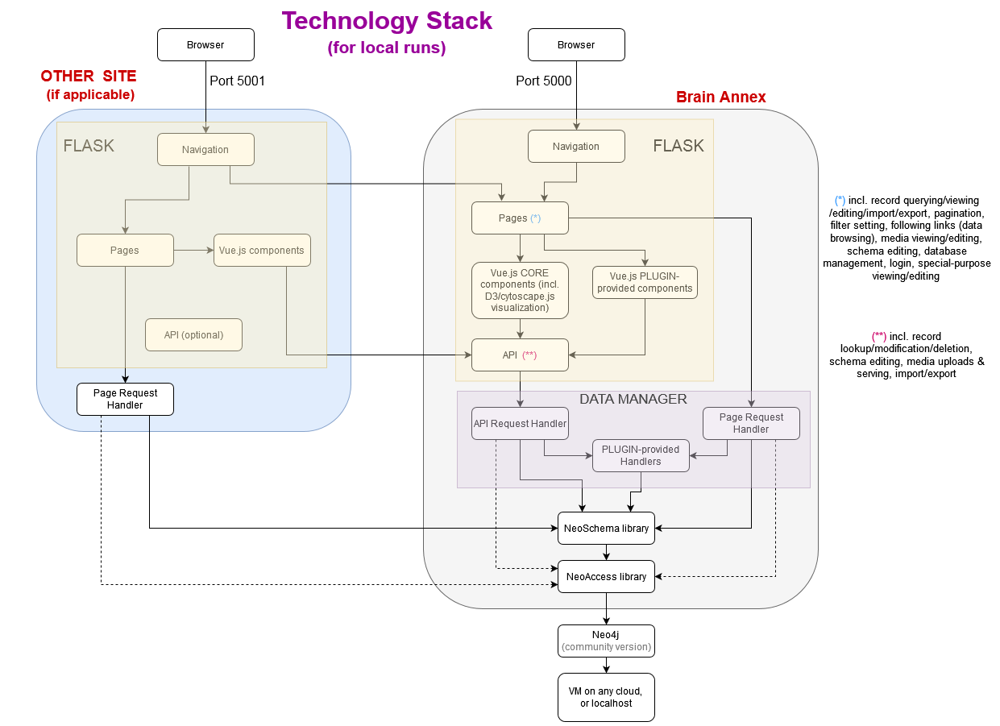
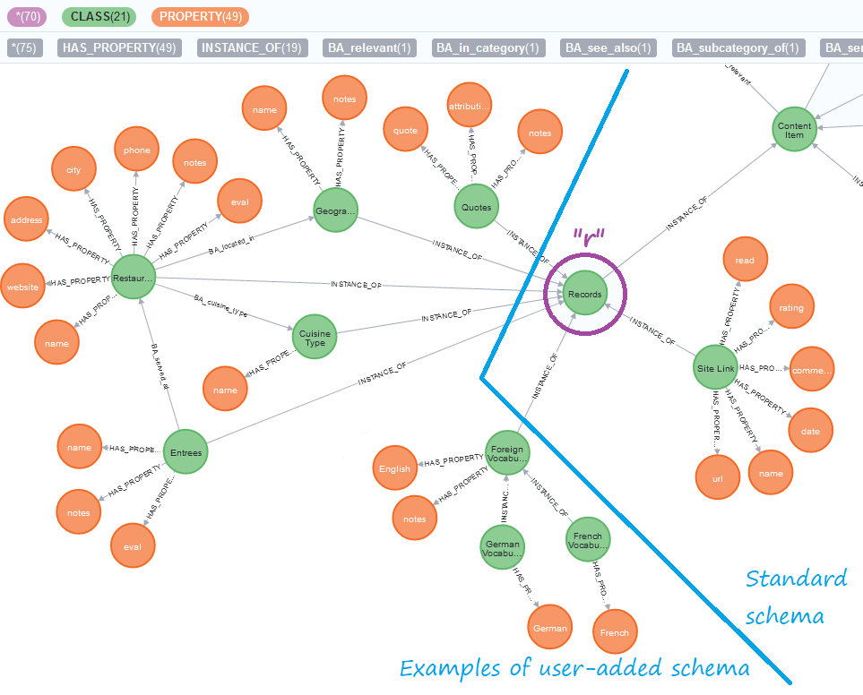

# Brain Annex - a full technology stack on top of GRAPH DATABASES

### This is a mono-repository of:

1) The "Brain Annex" python library
2) The "Brain Annex" web app (backend and frontend)

### Graph databases currently supported:

1) Neo4j, version 4.4 (the final release of major version 4)
2) Neo4j, version 5.26 (the final release of major version 5)
3) We expect to later support others, possibly Memgraph and AWS Neptune

### Do you only care about the python library?
Simply: 
* `pip install brainannex-neo4jv4`  
or 
* `pip install brainannex-neo4jv5`  
(based on **which major version of Neo4j** you use.)  
Nothing else to do!  

Then use it with imports such as:  
`from brainannex import GraphAccess`  
(notice that we are just saying `brainannex` here, NOT the full install name!)

### IMPORTANT for installing the web app - to switch between supported databases:
1) Must change the database driver, in the first line of `requirements.txt`
2) Must comment/uncomment the appropriate version lines in the `brainannex/__init__.py` file, 
for the `InterGraph` module, which is database-specific.

### Website: https://BrainAnnex.org

**[Change Log](https://brainannex.org/history)**

# Brain Annex's Technology Stack (Overview)

## BRAIN ANNEX PYTON LIBRARY

_From lower to higher levels:_

* **InterGraph library** (low-level, database-specific layer)

* **GraphAccess library** (python interface offering many services)

* **GraphSchema library** (optional Schema layer)
* _plus several other specialized high-level libraries_

---
#### What is a "Schema layer"?

A schema layer harmoniously brings together the best of the flexibility 
("anything goes!") of graph databases, 
and the "law and order" aspect of relational databases! 
*  [Motivation and Overview](https://julianspolymathexplorations.blogspot.com/2022/11/schema-graph-databases-neo4j.html)

* [User Guide](https://brainannex.org/docs/GraphSchema-user-guide.htm)

* [Reference Guide](https://brainannex.org/docs/GraphSchema.htm)
---

## BRAIN ANNEX WEB APP

* **Python/Flask** (for web API, and web app pages)

* **Vue2.js**

### EXAMPLE of use case : Multimedia Knowledge Representation and Management
[Motivation and overview](https://julianspolymathexplorations.blogspot.com/2019/03/multimedia-knowledge-representation-and-management-brain-annex.html)

## What are Neo4j/Graph Databases, and why do they matter?
If you're new, here's a 
[gentle brief intro](https://julianspolymathexplorations.blogspot.com/2023/10/intro-graph-databases-beginner.html). 

# Brain Annex's Technology Stack (Details)

Brain Annex may be used as a standalone web app, or used to power *other* web apps.  
The libraries that are the bottom layers may also be used independently.

# How to set up and use Brain Annex WEB APP

(Note: if you only care about the python library, just pip install it!  This section doesn't apply to you!)   

The underlying graph database and the Brain Annex web app may be installed either locally or on a remote server.

The database and web app may reside on the same or different machines.

## SETUP

[INSTRUCTIONS](https://brainannex.org/setup)

## EXAMPLES of Schemas available for import

(For instructions on how to import the Schemas, see the setup page, above)

#### EXAMPLE 1 - the available default Multimedia Content Management System

The ROOT node for the Categories is shown in blue at the top.

---

#### EXAMPLE 2 - same as example 1, but with sample extra Classes (representative of user-added schema)

The diagram below is split in 2 parts, for readability.

"chem" is an example of a custom Class.

The following second half of the diagram shows the remainder of the Schema, detailing Classes that are instances of the "Records" Class.
Most of the items in this diagram are examples of typical user-added schema:

# Major components
* **GraphAccess** : a library to connect to Neo4j with python. It provides many services.
  [Link](https://github.com/BrainAnnex/neoaccess)

* **GraphSchema** : a higher-level schema-based library on top of GraphAccess.
  [Link](https://github.com/BrainAnnex/brain-annex/blob/main/BrainAnnex/modules/neo_schema/neo_schema.py)<!-- @IGNORE PREVIOUS: link -->  
  [Article explaining this layer](https://julianspolymathexplorations.blogspot.com/2022/11/schema-graph-databases-neo4j.html)
  

* **CK Editor** : open-source JavaScript library to implement an online HTML Editor.  
  [Website](https://www.quackit.com/html/online-html-editor/full/).
  (Note: Brain Annex uses [version 4](https://ckeditor.com/docs/ckeditor4/latest/) of the CK Editor)
  

* **API** : the endpoints appear in [this file](https://github.com/BrainAnnex/brain-annex/blob/main/BrainAnnex/api/BA_api_routing.py)<!-- @IGNORE PREVIOUS: link -->

* **Web pages** : the pages generated by Brain Annex are listed in [this routing file](https://github.com/BrainAnnex/brain-annex/blob/main/BrainAnnex/pages/BA_pages_routing.py)<!-- @IGNORE PREVIOUS: link -->

* **Navigation bar** : Brain Annex can be used either as a standalone web app, or integrated with another site.  
  The navigation is implemented [in this package](https://github.com/BrainAnnex/brain-annex/tree/main/navigation)

### Project website: [https://BrainAnnex.org](https://BrainAnnex.org)

### The lead author of Brain Annex can be reached on [LinkedIn](https://www.linkedin.com/in/julian-%F0%9F%A7%AC-west-059997185/)