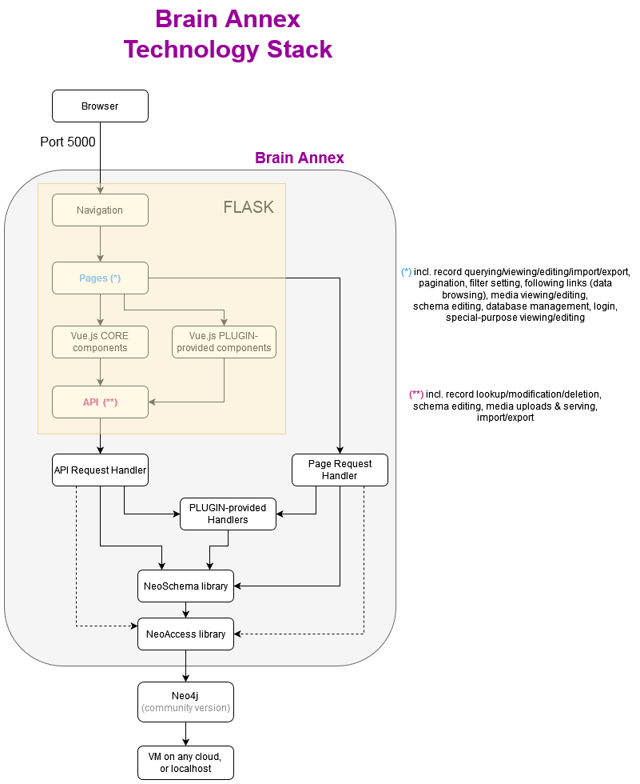
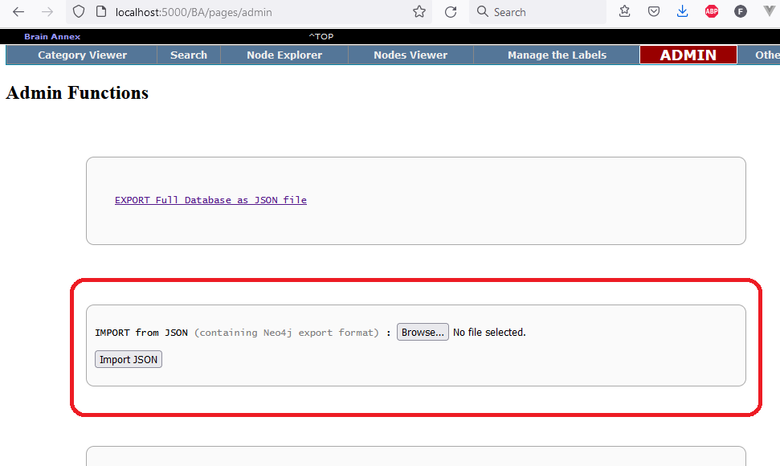
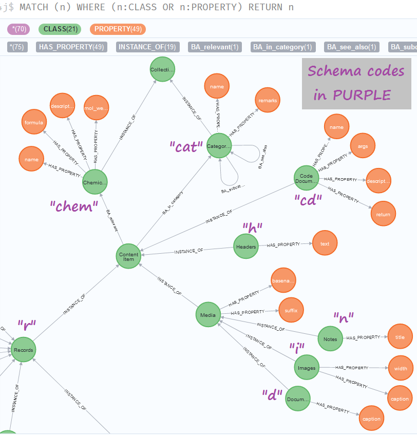
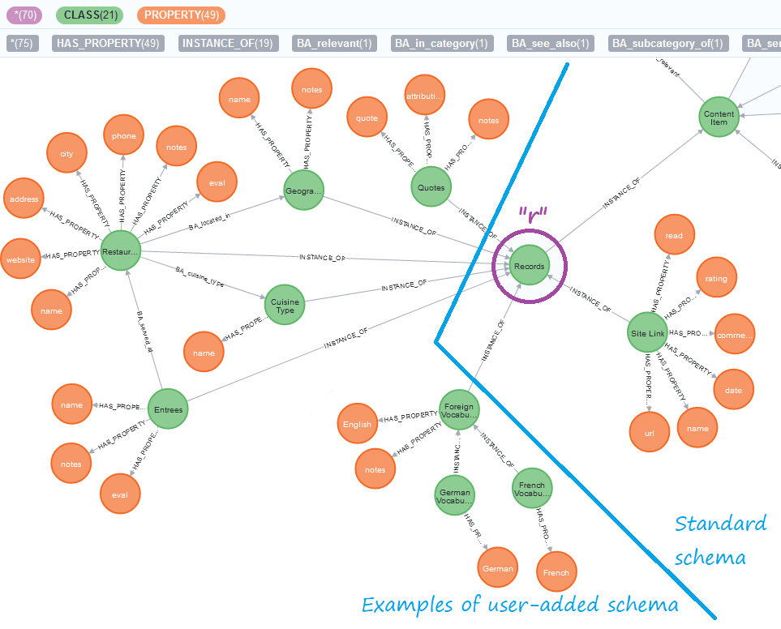
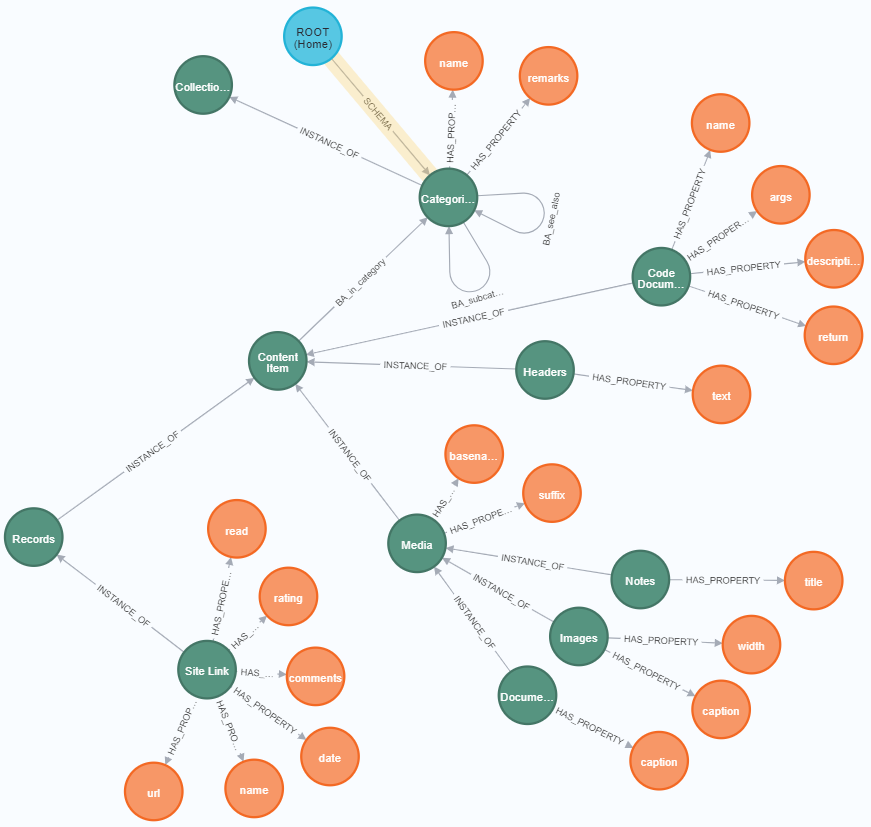

# Brain Annex, version 5

**Version 5** of Brain Annex is a complete overhaul of its internal structure:

* **Neo4j graph database** (v. 4.3) replaces MySQL and the built-in triplestore database

* **Python/Flask** replace the PHP/pForce framework

* **Vue2.js** has expanded to take on a full role, replacing the old vanilla-JavaScript parts

This major new release is currently in a *late Beta* stage.  
CURRENT VERSION: **VERSION 5.0-beta12**

**[Change Log](https://brainannex.org/viewer.php?ac=2&cat=14)**

## Background - Multimedia Knowledge Representation and Management
[What is Brain Annex?](https://julianspolymathexplorations.blogspot.com/2019/03/multimedia-knowledge-representation-and-management-brain-annex.html)
### Project website: https://BrainAnnex.org

## What are Neo4j/Graph Databases, and why do they matter?
If you're new, here's a 
[gentle brief intro](https://julianspolymathexplorations.blogspot.com/2021/02/neo4j-graph-databases-intro.html). 

# How to set up and use Brain Annex

This beta version support both local and remote databases, but the app is meant to be run or your local computer.

No authentication is yet implemented; so, if you use a remote database, 
you may want to set up a firewall that only lets in authorized IP addresses.

Due to the Beta stage, the installation stages aren't yet simplified.

**Install Neo4j**

All testing is done with *Neo4j version 4.3.4*, both the community and the enterprise versions.  (Use of
the enterprise version is NOT required for Brain Annex!)

You may install Neo4j on your computer, or on a virtual machine on the Cloud 
(we use the excellent pre-made Bitnami images on the Google cloud), or
use a Neo4j service provider such as [Neo4j Aura](https://neo4j.com/aura/).

If you're just testing, we highly recommend 
the free and super-easy [Neo4j Sandbox](https://neo4j.com/sandbox/).

**To Connect to the Neo4j Database from Python**

You must set the following Environmental Variables 
(based on your Neo4 installation/setup):

    NEO4J_HOST
    NEO4J_USER
    NEO4J_PASSWORD

If you're using PyCharm, you can set them from Run > Edit Configurations...
(Example: `NEO4J_PASSWORD=your_passwd;NEO4J_HOST=neo4j://localhost:7687;NEO4J_USER=neo4j`)

**Python 3.7+**

We test on Python 3.7/3.8 (3.6 *might* work - not tested - but not any earlier version, because of the use of Python f-strings.)

**Set up the local environment**

All dependencies (such as Flask, pandas, etc) are specified in the file `requirements.txt`

**Configuration (currently inside main.py)**

-  `MEDIA_FOLDER` (where the images, formatted text, documents, etc, are stored)  
   EXAMPLE (on Windows): `MEDIA_FOLDER = "D:/media/"`  
   IMPORTANT: for now, the media folder MUST include a subfolder called `"resized"`

- `UPLOAD_FOLDER` (temporary location for uploads)  
   EXAMPLE (on Windows): `MEDIA_FOLDER = "D:/tmp/"`

- `PORT_NUMBER` (ok keep the default 5000, unless you have a conflict)

**Start the Neo4j database**

For example, by using Neo4j Desktop, if you went the local database route.

If you installed it Neo4j yourself on a Linux machine, it can typically
be started with `sudo neo4j start`

If you're using the Bitnami image, it should start automatically,
but you can also issue `sudo gonit start neo4j`

**Allow remote access to Neo4j (if applicable)**

If remote access is needed (for example, if Neo4j is on the cloud),
one must open ports 7474, 7473, 7687,
and uncomment the line

`#dbms.default_listen_address=0.0.0.0`

in the Neo4j configuration file, typically found in locations such as
`/etc/neo4j/neo4j.conf` or (for the Bitnami image) `/opt/bitnami/neo4j/conf/neo4j.conf`

**Start the main program**

Launch `main.py`, which starts Flask and the included Werkzeug web server.
If it doesn't find the database (e.g., if you forgot to start Neo4j),
it'll give you an error message such as:
"Exception: CHECK WHETHER NEO4J IS RUNNING!"

**Open your favorite browser**

We test on Firefox and Chrome.

Set the URL to `http://localhost:5000/BA/pages/admin` (or whatever port number you used in your configuration)

You're now on the "Admin" page of the Brain Annex UI (the layout of this page may be different):

**Import the Schema**

Brain Annex is schema-based, and **it's critical that you import the standard schema.**
Use the **"IMPORT from JSON"** box on that "Admin" page.

For testing, we recommend importing the file `/BrainAnnex/init/Schema_EXAMPLE_plus_root_category.json`, which
includes various examples of user-added schema.

If you don't want the examples, there's the file `/BrainAnnex/Schema_MINIMAL_plus_root_category.json`, which
contains everything that is regarded as *fundamental* in a typical Brain Annex installation.

In addition to the Schema, both files contain the ROOT node for the Categories (which is regarded as a data point,
not part of the Schema.)

At the end of the import operation,
you should see a message about having imported a certain number of nodes and relationships.

Note - the imported schema may be seen by going to the Neo4j browser interface,
and issuing the Cypher command:

    MATCH (c1:CLASS)--(c2:CLASS)-[:HAS_PROPERTY]-(p:PROPERTY), (n:BA)
    RETURN c1, c2, p, n

The following diagram shows about 1/2 of the Schema.  "chem" is an example of a custom Class; the remaining
Classes are for a typical Brain Annex installation:

The following diagram shows the remainder of the Schema, detailing Classes that are instances of the "Records" Class.
Most of the items in this diagrams are examples of typical user-added schema, only present if you imported
the larger schema file with the examples:

Below is the **minimal** version of the JSON file imports - it's the combination of the previous 2 diagrams, minus 
any sample user customization.  Also shown here is the ROOT node for the Categories, in blue at the top.

**Optional: add Neo4j Indexes and Constraints**

Not strictly needed for test runs, but at some point Neo4j Indexes and Constraints 
ought to be added, for speed and reliability.
From the Neo4j browser interface, issue the following 3 Cypher commands:

    CREATE CONSTRAINT unique_BA_ID ON (n:BA) ASSERT n.item_id IS UNIQUE
    CREATE CONSTRAINT unique_CLASS_ID ON (n:CLASS) ASSERT n.schema_id IS UNIQUE
    CREATE CONSTRAINT unique_PROPERTY_ID ON (n:PROPERTY) ASSERT n.schema_id IS UNIQUE

# Major components
* **NeoAccess** : a library to connect to Neo4j.
  The APOC library must be installed on Neo4j to use the function export_dbase_json().  
  [Link](https://github.com/BrainAnnex/brain-annex/blob/main/BrainAnnex/modules/neo_access/neo_access.py)

* **NeoSchema** : a higher-level schema-based library on top of NeoAccess.
  [Link](https://github.com/BrainAnnex/brain-annex/blob/main/BrainAnnex/modules/neo_schema/neo_schema.py)
  

* **CK Editor** : open-source JavaScript library to implement an online HTML Editor.  
  [Website](https://www.quackit.com/html/online-html-editor/full/).
  (Note: Brain Annex uses [version 4](https://ckeditor.com/docs/ckeditor4/latest/) of the CK Editor)
  

* **API** : the endpoints appear in [this file](https://github.com/BrainAnnex/brain-annex/blob/main/BrainAnnex/api/BA_api_routing.py)

* **Web pages** : the pages generated by Brain Annex are listed in [this routing file](https://github.com/BrainAnnex/brain-annex/blob/main/BrainAnnex/pages/BA_pages_routing.py)

* **Navigation bar** : Brain Annex can be used either as a standalone web app, or integrated with another site.  
  The navigation is implemented [in this package](https://github.com/BrainAnnex/brain-annex/tree/main/navigation)

### Project website: https://BrainAnnex.org

### The lead author of Brain Annex can be reached on [LinkedIn](https://www.linkedin.com/in/julian-%F0%9F%A7%AC-west-059997185/)