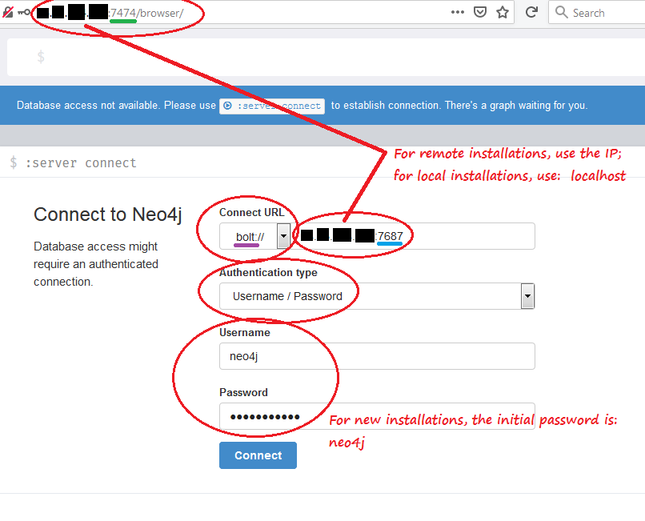
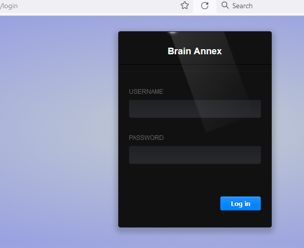

# Brain Annex, version 5.0-beta17 IN-PROGRESS

**Version 5** of is a *complete overhaul* of Brain Annex's  internal structure:

* **Neo4j graph database** (v. 4.3) replaces MySQL and the built-in triplestore database

* **Python/Flask** replace the PHP/pForce framework

* **Vue2.js** has expanded to take on a full role, replacing the old vanilla-JavaScript parts

This major new release is currently in a *late Beta* stage, appproaching "release candidate".

**[Change Log](https://brainannex.org/viewer.php?ac=2&cat=14)**

## Background - Multimedia Knowledge Representation and Management
[What is Brain Annex?](https://julianspolymathexplorations.blogspot.com/2019/03/multimedia-knowledge-representation-and-management-brain-annex.html)
### Project website: https://BrainAnnex.org

## What are Neo4j/Graph Databases, and why do they matter?
If you're new, here's a 
[gentle brief intro](https://julianspolymathexplorations.blogspot.com/2021/02/neo4j-graph-databases-intro.html). 

# How to set up and use Brain Annex

Brain Annex supports both local and remote setup of the web app and the Neo4j database.

The database and web app may reside on the same or different machines.

## PART 1 - Set up the Database

**Install Neo4j**

All testing is done with *Neo4j version 4.3*, community version.  (Use of
the enterprise version is NOT required for Brain Annex!)

You may install Neo4j on your computer, or on a virtual machine on the Cloud 
(we use the excellent pre-made Bitnami images on the Google cloud,
as well as the inexpensive Oracle cloud);  
or use a Neo4j hosting service such as [Neo4j Aura](https://neo4j.com/aura/).

If you're just testing, we highly recommend 
the free and super-easy [Neo4j Sandbox](https://neo4j.com/sandbox/).

To download and install Neo4j on your local machine or server: [link](https://neo4j.com/download-center/#community).

Note: for installations on a local machine, the [Neo4j Desktop](https://neo4j.com/download-center/#desktop) is a very convenient alternative  
(but be aware that it ties you to a trial copy of the *Enterprise* version of Neo4j!)

**Install Java, if needed**

If doing your own installation, *Java SE Development Kit 11* is needed.
(NOT needed if you use the Neo4j Desktop; the pre-made Bitnami images on the Google cloud already includes Java.)

You can check if Java is already installed by issuing `java -version`  
on your Linux shell or Windows PowerShell or Command Prompt window.

On Ubuntu and other Linux versions, Java may be installed, if needed, with:

    sudo apt install openjdk-11-jre-headless

On Windows, use [this link from Oracle](https://www.oracle.com/java/technologies/downloads/#java11)  (look for the Windows x64 Installer.)

**Start the Neo4j database**

If you went the local database route, it's very convenient to use the Neo4j Desktop to stop/start the database.

If you installed Neo4j on a Linux machine, it can typically
be started with `sudo neo4j start`

If you're using the Bitnami image, it should start automatically;
but you can also issue `sudo gonit start neo4j`

**Allow remote access to Neo4j (if applicable)**

If remote access is needed (i.e. if the database and the app are on different machines),
one must open ports 7474, 7473, 7687,  
and uncomment the line

`#dbms.default_listen_address=0.0.0.0`

in the Neo4j configuration file,  
typically found in locations such as `/etc/neo4j/neo4j.conf`  
or (for the Bitnami image) `/opt/bitnami/neo4j/conf/neo4j.conf`

**Test Neo4j access thru its Browser Interface**

**Install the Neo4j APOC libraries (optional but highly recommended)**

The Neo4j APOC libraries are currently needed for making a JSON dump of all the Neo4j data,
or just the schema, using Brain Annex's admin control panel.

If you're using Neo4j locally, with the Neo4j Desktop app, then installing APOC is a just
a click away, as detailed in the following screenshot:

If you installed Neo4j on a server, follow these [instructions on installing APOC](https://github.com/neo4j-contrib/neo4j-apoc-procedures#manual-installation-download-latest-release).

## PART 2 - Set up the Brain Annex web app

**Clone the repository**

Clone the repository to either your local machine or to your server.

To clone to a Windows machine, we recommend using the awesome program GitHub Desktop.

To clone to a Linux machine - if remote, after doing an SSH connection to it - you may use commands  
such as (change the location directory, if desired):

    cd /
    sudo mkdir brain_annex
    sudo git clone --verbose --config http.sslVerify=false https://github.com/BrainAnnex/brain-annex.git brain_annex
    (If git is not already installed, install it with:   sudo apt-get install git)

**Python 3.7+**

We test on Python 3.7/3.8 (3.6 *might* work - not tested - but not any earlier version, because of the use of Python "f-strings.")
Make sure that you have the right version of Python installed.

    python3 --version       (on Linux)
    python --version        (on the Windows command prompt or Power shell)

**Folder setup**

Create or designate:
- A folder for the **media** files.  
IMPORTANT: for now, the media folder MUST include a subfolder called `"resized"`  
EXAMPLE (on Windows): create a folder named "media" on the "D" drive, and a subfolder named "resized" inside it.  
EXAMPLE (on Linux):

        cd ~
        mkdir media
        mkdir media/resized

- A folder for the **uploaded** files.  
EXAMPLE (on Windows): create a folder named "tmp" on the "D" drive  
EXAMPLE (on Linux): do nothing. Just use `/tmp/`

**Brain Annex Configuration**

Duplicate the file `config.defaults.ini` and rename the copy as `config.ini`

Edit `config.ini` (for example, open with "notepad" on Windows, or  `sudo vim` on Linux),  
to change, as needed, values for:

- `NEO4J_HOST` (the default `neo4j://localhost:7687` is for situations when the databse is on the same machine;
if it is on another machine, use values such as `bolt://123.456.0.29:7687` or `bolt://your_domain.com:7687`)

- `NEO4J_USER`
- `NEO4J_PASSWORD`

- `MEDIA_FOLDER` (where the images, formatted text, documents, etc, are stored)  
   EXAMPLE (on Windows): `MEDIA_FOLDER = "D:/media/"`  
   EXAMPLE (on Linux): `MEDIA_FOLDER = "/home/your_user_name/media/"`

- `UPLOAD_FOLDER` (temporary location for uploads)  
   EXAMPLE (on Windows): `UPLOAD_FOLDER = "D:/tmp/"`  
   EXAMPLE (on Linux): `UPLOAD_FOLDER = "/tmp/"`

- `PORT_NUMBER` (ok to keep the default 5000, unless you have a conflict)

(Note: an alternate way to set the database credentials is thru environment variables;
if you're running locally, using PyCharm, you can set the environment variables from Run > Edit Configurations...)

**Install all dependencies in the virtual environment**

All dependencies (such as Flask, pandas, etc) are specified in the file `requirements.txt`  
If you're running Brain Annex locally with PyCharm, you'll simply be prompted
as to whether you want to install the requirements.

If you're installing Brain Annex on a Linux server, you need
to manually create a virtual environment, using `pip3` or your favorite command.  
For example (change "brain_annex", if you used a different location):

    $ ls /brain_annex                    (all project files should be there, incl. README.md, but NO venv folder)
    $ sudo chmod go+w /brain_annex       (because /brain_annex is owned by the root; to avoid trouble during pip3 install later!)
    $ sudo apt-get install python3-venv  (only needed if the next command fails)
    $ python3 -m venv /brain_annex/venv  (IMPORTANT: do NOT use sudo here, or permissions will get messed up!  It creates a new virtual environment, but doesn't install any Packages)
    $ ls -alF /brain_annex/venv/bin      (it shows the various "Activate" files, and the links to the python executables)
    $ cd /brain_annex
    $ source venv/bin/activate           (to enter the context of the new virtual environment)
    
    [Notice how the prompt is now prefixed with the name of your environment (venv, in our case). This is the indicator that venv is currently active, 
    which means the python executable will only use this environment’s packages and settings.]
    
    (venv) $ pip3 install -r requirements.txt   (IMPORTANT: no worries about "ERROR: Failed building wheel for neo4j"; it automatically recovers from it!)
    
    (venv) $ pip3 list                          (to see all the installed packages; note that neo4j is there, in spite of the earlier error message)
    (venv) $ deactivate                         (to leave the context of the new virtual environment)

In case of failures during the installation, try:

    (venv) pip install --upgrade pip
    (venv) pip install wheel

**Starting Brain Annex**

The first order of business is to test the connection to the Neo4j Database from Python.

IMPORTANT: did you remember to start the Neo4j server?

_For **LOCAL** installations:_

Run `main.py`, which starts Flask and the included Werkzeug web server.
If it doesn't find the database (e.g., if you forgot to start Neo4j),
it'll give you an error message such as:
"Exception: CHECK WHETHER NEO4J IS RUNNING!"

In case of database-connection problems, you may also try to run the following 2 diagnostic files:
1. tests/tests_manual/db_connection_1_MANUAL.py
2. tests/tests_manual/db_connection_2_MANUAL.py

_For **SERVER** installations:_

On a Linux server, you can do:

    (you may skip the first 2 steps, if you never deactivated from earlier)
    $ cd /brain_annex  
    $ source venv/bin/activate 
    
    (venv) $ export PYTHONPATH=$PYTHONPATH:`pwd`/venv/lib/python3.8/site-packages   [OR 3.7, depending which one you have]
    (venv) $ python3 diagnostics.py    (just for testing, if desired; make sure that '/brain_annex' appears in the sys.path)
     
    (venv) $ python3 tests/tests_manual/db_connection_1_MANUAL.py       (just for testing, if desired)
    (venv) $ python3 tests/tests_manual/db_connection_2_MANUAL.py       (just for testing, if desired)
        
    (venv) $ export FLASK_APP=main.py
    (venv) $ flask run --host=0.0.0.0 --port 5000 &> flask_log.txt &    (to redirect both stdout and stderr; change port if desired - but 80 won't work)
    (venv) $ ps -e | grep flask              (to double-check there's a 'flask' process running in the background)
    (venv) $ deactivate
    
    $ cat /brain_annex/flask_log.txt         (to check the log) 

IMPORTANT:
1. is the port number that you're using open on your server's firewall?
2. did you start the Neo4j server?

**Log in from your favorite browser**

We test on Firefox and Chrome.

If running remotely, set your browser to `http://YOUR_SERVER_IP_ADDRESS:5000`

If running locally, set your browser to  `http://localhost:5000`

(replace 5000 with whatever port number you used in your configuration.)

Click on "Test page", which doesn't require login.  Then use the back button on your browser; this time,
select the "Login" link.  But, first, you'll need to create login accounts (see the next section.)

**Create user login account**

For now, user login accounts need to be manually created from the Neo4j browser interface (see earlier section.)

Use Cypher queries such as:

    CREATE  (n:`User Login` {user_id: 1, username: "the_desired_username", password: "the_desired_password"})

**Import the Schema**

Go to the "Admin" page of the Brain Annex UI (the layout of this page may be different):

Brain Annex is schema-based, and **it's critical that you import the standard schema.**
Use the **"IMPORT from JSON"** box on that "Admin" page.

For testing, we recommend importing the file `/BrainAnnex/init/Schema_EXAMPLE_plus_root_category.json`, which
includes various examples of user-added schema.

If you don't want the examples, there's the file `/BrainAnnex/Schema_MINIMAL_plus_root_category.json`, which
contains everything that is regarded as *fundamental* in a typical Brain Annex installation.

In addition to the Schema, both files contain the ROOT node for the Categories (which is regarded as a data point,
not part of the Schema.)

At the end of the import operation,
you should see a message about having imported a certain number of nodes and relationships.

Note - the imported schema may be seen by going to the Neo4j browser interface,
and issuing the Cypher command:

    MATCH (c1:CLASS)--(c2:CLASS)-[:HAS_PROPERTY]-(p:PROPERTY), (n:BA)
    RETURN c1, c2, p, n

The following diagram shows about 1/2 of the Schema.  "chem" is an example of a custom Class; the remaining
Classes are for a typical Brain Annex installation:

The following diagram shows the remainder of the Schema, detailing Classes that are instances of the "Records" Class.
Most of the items in this diagrams are examples of typical user-added schema, only present if you imported
the larger schema file with the examples:

Below is the **minimal** version of the JSON file imports - it's the combination of the previous 2 diagrams, minus 
any sample user customization.  Also shown here is the ROOT node for the Categories, in blue at the top.

**Optional: add Neo4j Indexes and Constraints**

Not strictly needed for test runs, but at some point Neo4j Indexes and Constraints 
ought to be added, for speed and reliability.
From the Neo4j browser interface, issue the following Cypher commands:

    CREATE CONSTRAINT unique_BA_ID ON (n:BA) ASSERT n.item_id IS UNIQUE
    CREATE CONSTRAINT unique_CLASS_ID ON (n:CLASS) ASSERT n.schema_id IS UNIQUE
    CREATE CONSTRAINT unique_CLASS_NAME ON (n:CLASS) ASSERT n.name IS UNIQUE
    CREATE CONSTRAINT unique_PROPERTY_ID ON (n:PROPERTY) ASSERT n.schema_id IS UNIQUE

# Major components
* **NeoAccess** : a library to connect to Neo4j.
  The APOC library must be installed on Neo4j to use the function export_dbase_json().  
  [Link](https://github.com/BrainAnnex/brain-annex/blob/main/BrainAnnex/modules/neo_access/neo_access.py)

* **NeoSchema** : a higher-level schema-based library on top of NeoAccess.
  [Link](https://github.com/BrainAnnex/brain-annex/blob/main/BrainAnnex/modules/neo_schema/neo_schema.py)
  

* **CK Editor** : open-source JavaScript library to implement an online HTML Editor.  
  [Website](https://www.quackit.com/html/online-html-editor/full/).
  (Note: Brain Annex uses [version 4](https://ckeditor.com/docs/ckeditor4/latest/) of the CK Editor)
  

* **API** : the endpoints appear in [this file](https://github.com/BrainAnnex/brain-annex/blob/main/BrainAnnex/api/BA_api_routing.py)

* **Web pages** : the pages generated by Brain Annex are listed in [this routing file](https://github.com/BrainAnnex/brain-annex/blob/main/BrainAnnex/pages/BA_pages_routing.py)

* **Navigation bar** : Brain Annex can be used either as a standalone web app, or integrated with another site.  
  The navigation is implemented [in this package](https://github.com/BrainAnnex/brain-annex/tree/main/navigation)

### Project website: [https://BrainAnnex.org](https://BrainAnnex.org)

### The lead author of Brain Annex can be reached on [LinkedIn](https://www.linkedin.com/in/julian-%F0%9F%A7%AC-west-059997185/)